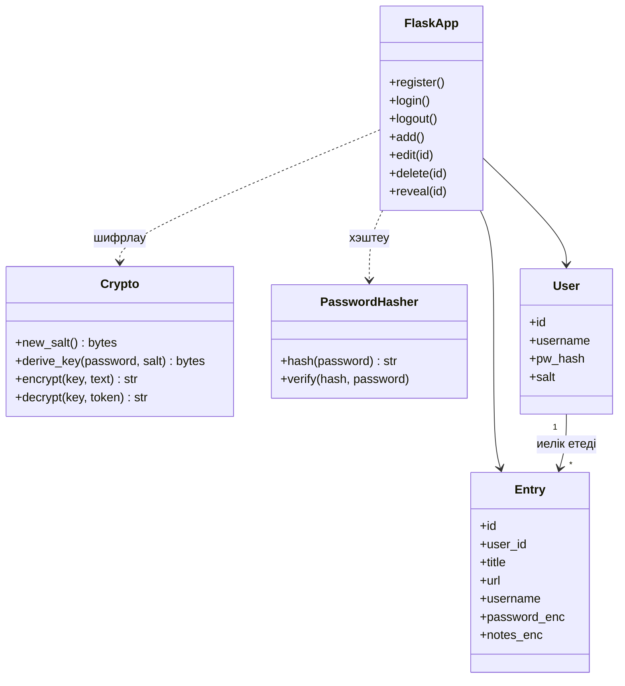
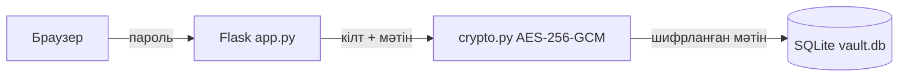

# Сейф: пароль менеджері

Шифрлауы бар пароль менеджері веб-қосымшасы. Python, Flask және SQLite негізінде жасалған.

## Мүмкіндіктер

- Тіркелу және master парольмен кіру
- Пароль қосу, көру, көшіру, өңдеу, жою
- Атауы немесе логин бойынша іздеу
- Күшті кездейсоқ пароль генераторы
- Көрсетілген пароль 15 секундтан кейін жасырылады, көшірілген пароль 30 секундтан кейін буферден өшеді

## Қауіпсіздік

| Қорғаныс | Қалай жұмыс істейді |
|---|---|
| Master пароль | Argon2 арқылы хэштеледі, ашық күйінде сақталмайды |
| Шифрлау кілті | Master парольден scrypt арқылы алынады, әр пайдаланушыға жеке salt |
| Сайт парольдері және жазбалар | AES-256-GCM арқылы шифрланып сақталады |
| Кілтті сақтау | Cookie-ге жазылмайды, тек сервер жадында тұрады |
| CSRF | Әр POST сұранысына токен тексеріледі |
| HTTP тақырыптары | CSP, X-Frame-Options, X-Content-Type-Options, Cache-Control |

## Архитектура

### Класс диаграммасы



### Деректің жолы



Ашық пароль дерекқорға ешқашан түспейді, тек шифрланған мәтін сақталады.

## Жоба құрылымы

```
password-manager/
├── app.py             Flask қосымшасы: маршруттар, сессия, CSRF
├── crypto.py          Кілт алу (scrypt) және шифрлау (AES-256-GCM)
├── requirements.txt   Кітапханалар тізімі
├── templates/         HTML беттері
├── static/            CSS және JavaScript
├── .gitignore
└── README.md
```

## Орнату және іске қосу

Python 3.10 немесе жоғары қажет.

```bash
python -m venv venv
venv\Scripts\activate          # Windows
# source venv/bin/activate     # Mac/Linux
pip install -r requirements.txt
flask run
```

Браузерде http://127.0.0.1:5000 ашыңыз.

## Ескертулер

- Master парольді ұмытсаңыз, сақталған парольдерді қалпына келтіру мүмкін емес.
- Сервер қайта қосылса, шифрлау кілттері жадтан жоғалады, сондықтан қайтадан кіру керек.
- Интернетке шығару үшін HTTPS және gunicorn сияқты production сервер қажет.
- `vault.db` және `secret.key` файлдары `.gitignore` арқылы GitHub-қа салынбайды.

## Қолданылған технологиялар

Python, Flask, SQLite, cryptography, argon2-cffi, HTML, CSS, JavaScript.
